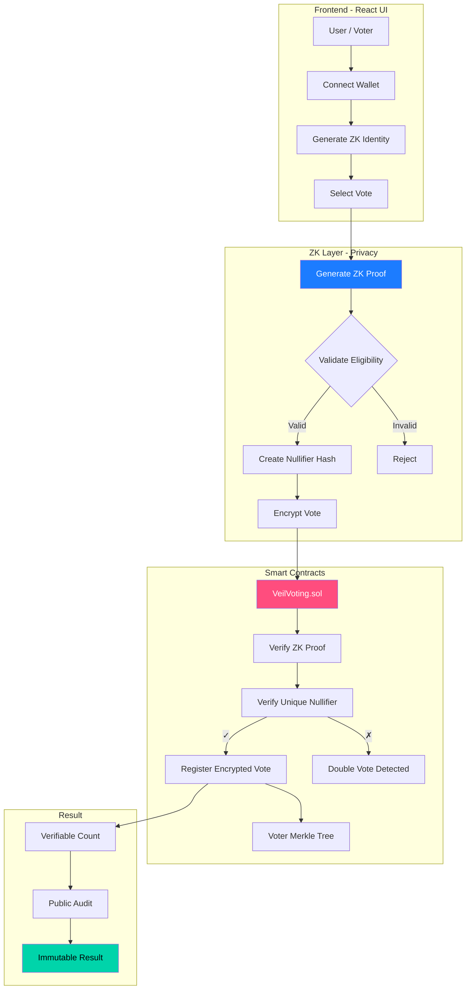
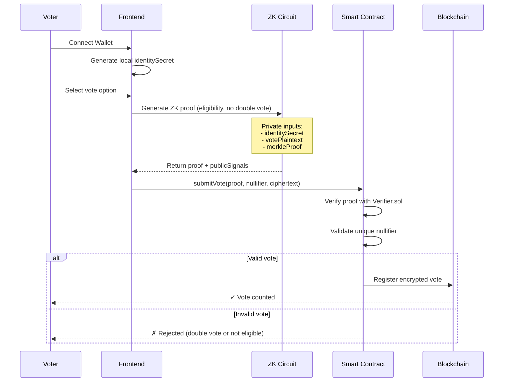

# Glacier

> **Anonymous DAO Governance powered by Zero-Knowledge Proofs on Avalanche**

## 🎯 The Problem

Traditional on-chain voting exposes voter preferences, creating risks of:
- 💰 **Vote buying** - Your wallet address reveals how you voted
- 😨 **Voter intimidation** - Large token holders can coerce smaller voters
- 🔍 **Privacy loss** - All voting decisions are permanently public
- ⚖️ **Unfair influence** - Fear of retaliation affects decision-making

## ✨ The Solution

**Glacier** enables **completely anonymous** governance voting while maintaining full verifiability. Using Zero-Knowledge Proofs (ZK-SNARKs), voters can prove they're eligible to vote WITHOUT revealing:
- Their wallet address
- Their voting choice
- Their token holdings

### Key Features

- **🔒 Total Anonymity**: Your identity is never associated with your vote on-chain
- **✅ Fully Verifiable**: Anyone can audit that only eligible voters participated  
- **🛡️ Coercion-Resistant**: Impossible to prove how you voted without revealing your private key
- **⚡ Fast & Cheap**: Built on Avalanche for instant finality and low fees
- **🔗 DAO-Ready**: Perfect for DeFi protocols, NFT communities, and Web3 organizations

### Technical Architecture



### Vote Flow



## Monorepo Structure

```
glacier-zk-votes/
├── package.json              # Root workspace configuration
├── README.md                 # This file
├── .gitignore               # Global git ignore
├── frontend/                # React frontend
├── contracts/               # Smart contracts (Foundry)
│   ├── src/                 # Solidity contracts
│   ├── test/                # Contract tests
│   ├── script/              # Deploy scripts
│   └── foundry.toml         # Foundry configuration
├── zk-circuits/             # ZK circuits (Circom)
│   ├── circuits/            # .circom files
│   ├── scripts/             # Compilation scripts
│   ├── build/               # Generated artifacts
│   └── package.json         # ZK dependencies
├── scripts/                 # Global scripts
│   ├── deploy-fuji.sh      # Deploy to Fuji testnet
│   ├── local-dev.sh        # Local development
│   └── setup.sh            # Initial setup
├── shared/                  # Shared code
│   ├── types/               # TypeScript types
│   └── utils/               # Common utilities
└── docs/                   # Documentation
    ├── WHITEPAPER.md        # Technical whitepaper
    └── DEPLOY.md            # Deployment guide
```

## ⚡ Why Avalanche?

Glacier is built specifically for Avalanche to leverage:

- **🚀 Instant Finality**: ~2 second confirmation times for real-time voting
- **💰 Low Fees**: Cost-effective governance for all DAOs, not just whales
- **🔗 EVM Compatible**: Easy integration with existing DeFi protocols
- **🌐 Scalability**: Handle thousands of simultaneous votes without congestion
- **🏔️ Avalanche Subnets**: Future-ready for custom governance chains

## Technical Stack

### Blockchain
- **Avalanche C-Chain** (Fuji Testnet for demo)
- Solidity 0.8.20 (Smart contracts)
- Foundry (Testing and deployment)

### Zero-Knowledge
- **Circom 2.1.0** (ZK circuit design)
- **SnarkJS 0.7.4** (Proof generation)
- **Groth16** (Efficient proof system)

### Frontend
- React 18 + TypeScript
- Vite (Ultra-fast build)
- Ethers.js v6 (Avalanche interaction)

### Cryptography
- **Poseidon Hash** (ZK-optimized hashing)
- **Merkle Trees** (Voter eligibility proofs)
- **Nullifiers** (Double-vote prevention)

## System Components

### Smart Contracts
- **VeilVoting.sol**: Main voting contract
- **Verifier.sol**: ZK proof verifier (generated by Circom)

### ZK Layer
- **Circom Circuit**: Verifies eligibility (Merkle proof) + unique nullifier
- **Public inputs**: `[merkleRoot, nullifierHash, ciphertextHash, electionId]`
- **Private inputs**: `identitySecret, votePlaintext, merkleProof`

### Frontend
- React + TypeScript + Vite
- Wallet integration (MetaMask compatible)

## Quick Start

### Prerequisites
```bash
# Node.js >= 18
node --version

# Foundry (for contracts)
curl -L https://foundry.paradigm.xyz | bash
foundryup

# Circom & snarkjs (for ZK)
npm install -g circom snarkjs
```

### Initial Setup
```bash
# Clone and configure
git clone <repo-url>
cd glacier-zk-votes
npm run setup

# Local development
npm run dev
```

### Build and Deploy
```bash
# Complete build
npm run build

# Deploy to testnet
npm run deploy:fuji

# Run tests
npm run test
```

## Development Commands

| Command | Description |
|---------|-------------|
| `npm run dev` | Start frontend in development |
| `npm run build` | Complete build (contracts + circuits + frontend) |
| `npm run test` | Run contract tests |
| `npm run circuits:compile` | Compile ZK circuits |
| `npm run deploy:fuji` | Deploy to Fuji testnet |
| `npm run clean` | Clean artifacts |

## 🎪 Demo Use Case: Community DAO Governance

**Scenario**: A DeFi protocol needs to vote on protocol upgrades

**Problem**: Traditional voting reveals which whales voted for what, creating:
- Whale manipulation possibilities
- Social pressure on smaller voters
- Public disagreements that harm community

**Glacier Solution**:
1. ✅ **Anonymous Voting**: No one knows who voted for what
2. ✅ **Provably Fair**: ZK proofs ensure only token holders vote
3. ✅ **No Double Voting**: Nullifiers prevent fraud
4. ✅ **Instant Results**: Avalanche's 2-second finality

**Try it**: [Live Demo on Avalanche Fuji Testnet](#demo)

## 💡 Additional Use Cases

- **DeFi Protocols**: Treasury management, protocol upgrades
- **NFT DAOs**: Community decisions, artwork selection
- **Gaming Guilds**: Strategy votes, resource allocation
- **Investment DAOs**: Portfolio decisions without influence

## Documentation

- [Technical Whitepaper](./docs/WHITEPAPER.md)
- [Deployment Guide](./docs/DEPLOY.md)

## License

MIT - See [LICENSE](./LICENSE)

---

**Glacier** - Anonymous ZK Voting System
