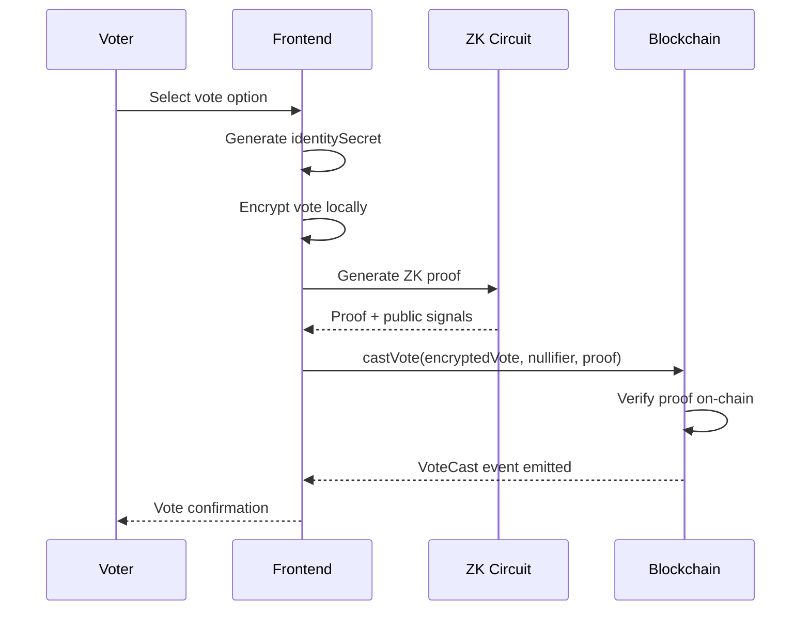

# Technical Whitepaper - Glacier

**Anonymous Voting System on Avalanche**

---

## Executive Summary

Glacier is an anonymous and verifiable voting system built on the Avalanche network that uses zero-knowledge proofs (ZK-SNARKs) to guarantee voter privacy while maintaining the integrity and verifiability of the electoral process.

### Problem

Traditional blockchain voting systems expose voter preferences, creating risks of:
- Loss of political privacy
- Coercion and vote buying
- Retaliation for voting decisions
- Reluctance to participate in governance

### Solution

Glacier implements anonymous voting through:
- **Local encryption** of votes on the client
- **ZK proofs** that demonstrate eligibility without revealing identity
- **Unique nullifiers** that prevent double voting
- **On-chain verification** without exposing sensitive data

## System Architecture

### Main Components

1. **Frontend (React + TypeScript)**
   - User interface with Avalanche aesthetics
   - ZK proof generation on client
   - Local vote encryption
   - Wallet integration

2. **Smart Contracts (Solidity)**
   - `VeilVoting.sol`: Main voting contract
   - `Verifier.sol`: ZK proof verifier generated by Circom

3. **ZK Circuits (Circom)**
   - `vote_verifier.circom`: Circuit that proves eligibility and validity
   - Merkle tree inclusion verification
   - Nullifier calculation and validation

### Voting Flow



## Technical Specifications

### Cryptography

#### Hash Functions
- **Poseidon**: Hash function optimized for ZK circuits
- **Keccak256**: For Ethereum/Avalanche compatibility

#### Merkle Trees
- **Levels**: 20 (supports up to ~1M voters)
- **Leaves**: `Poseidon(identitySecret)` of eligible voters
- **Inclusion Proof**: Path elements + indices to verify membership

#### Nullifiers
```
nullifierHash = Poseidon(identitySecret, electionId)
```
- Unique per voter and election
- Prevents double voting without revealing identity
- Verified on-chain with each vote

#### Encryption
- **AES-256-GCM**: Local vote encryption
- **Key derivation**: HKDF with identitySecret + electionId
- **Binding**: Ciphertext hash included in public signals

### ZK Circuit Design

#### Private Inputs (Witness)
- `identitySecret`: Voter's unique secret
- `votePlaintext`: Selected vote option
- `merkleProof[]`: Merkle tree path elements
- `merkleIndices[]`: Inclusion path indices
- `nonce`: Random value for binding

#### Public Inputs
- `merkleRoot`: Root of eligible voters tree
- `nullifierHash`: Unique nullifier hash
- `ciphertextHash`: Hash of encrypted vote
- `electionId`: Election identifier
- `maxVoteOptions`: Maximum number of options

#### Constraints
1. **Merkle Inclusion**: Proves that `identitySecret` is in the tree
2. **Nullifier Computation**: `nullifierHash = Poseidon(identitySecret, electionId)`
3. **Vote Range**: `0 ≤ votePlaintext < maxVoteOptions`
4. **Ciphertext Binding**: `ciphertextHash = Poseidon(votePlaintext, nonce)`

### Smart Contract Specification

#### VeilVoting.sol

```solidity
contract VeilVoting {
    struct Election {
        bytes32 merkleRoot;
        address admin;
        uint256 startTime;
        uint256 endTime;
        uint256 voteCount;
        bool active;
    }
    
    function castVote(
        uint256 electionId,
        bytes32 encryptedVote,
        bytes32 nullifierHash,
        bytes calldata proof,
        uint256[] calldata pubSignals
    ) external;
    
    function createElection(
        bytes32 merkleRoot,
        uint256 duration
    ) external returns (uint256);
}
```

#### Events
```solidity
event VoteCast(
    bytes32 indexed encryptedVote,
    bytes32 indexed nullifierHash,
    uint256 indexed electionId
);
```

## Security and Privacy

### Security Guarantees

1. **Voter Privacy**
   - Identity not stored on-chain
   - Only nullifierHash and encryptedVote recorded
   - ZK proof does not reveal private information

2. **Electoral Integrity**
   - One vote per voter (unique nullifier)
   - Only eligible voters (Merkle proof)
   - Verifiable proofs on-chain

3. **Attack Resistance**
   - **Coercion**: No way to prove specific vote
   - **Vote buying**: Impossible to demonstrate vote to third parties
   - **Replay**: Nullifiers prevent reuse
   - **Sybil**: Whitelist of eligible voters

### Privacy Considerations

#### Metadata Leakage
- **Timing**: Voting timestamps visible
- **Gas**: Gas patterns may be correlated
- **IP**: VPN usage recommended for complete privacy

#### Mitigations
- Transaction batching to reduce timing correlation
- Gas price randomization
- Best practices documentation for voters

## Avalanche Implementation

### Avalanche Advantages
- **Low latency**: Confirmations in ~1-2 seconds
- **Low fees**: Economic transactions
- **Finality**: Instant security
- **EVM Compatible**: Ethereum tooling reuse

### Network Configuration

#### Fuji Testnet
- **Chain ID**: 43113
- **RPC**: `https://api.avax-test.network/ext/bc/C/rpc`
- **Explorer**: https://testnet.snowtrace.io
- **Faucet**: https://faucet.avax.network

#### Mainnet (Production)
- **Chain ID**: 43114
- **RPC**: `https://api.avax.network/ext/bc/C/rpc`
- **Explorer**: https://snowtrace.io

### Gas Optimization

#### Gas Estimations
- **Deploy Verifier**: ~1.2M gas
- **Deploy VeilVoting**: ~800K gas
- **Cast Vote**: ~150K-450K gas (depends on circuit)
- **Create Election**: ~100K gas

#### Optimizations
- Batch verification for multiple proofs
- Precomputed verification keys
- Efficient Solidity verifier generation

## Use Cases

### 1. DAO Governance
- Proposal voting without revealing preferences
- Anonymous vote delegation
- Protection against whale dominance

### 2. Corporate Elections
- Board of directors
- Strategic decisions
- Employee surveys

### 3. Public Voting
- Referendums
- Municipal elections
- Citizen consultations

### 4. Research and Surveys
- Academic studies
- Market research
- Medical research

## Limitations and Future Improvements

### Current Limitations

1. **Trusted Setup**
   - Initial ceremony required for circuits
   - Transparency in setup process critical

2. **Scalability**
   - Proof generation time on client
   - Limited Merkle tree size

3. **Counting**
   - Manual decryption for final tally
   - No automatic ZK tallying

### Future Improvements

#### Phase 2: ZK Tallying
- Completely ZK counting
- Results without decrypting individual votes
- Private vote aggregation

#### Phase 3: Subnets
- Implementation on Avalanche Subnets
- Higher throughput and customization
- Domain-specific governance

#### Phase 4: Mobile & Usability
- Native mobile apps
- Simplified UX for non-technical voters
- Digital identity integration

## Conclusion

Glacier represents a significant advancement in blockchain voting systems, combining the transparency and verifiability of distributed technology with robust privacy guarantees through ZK-SNARKs.

The implementation on Avalanche provides the necessary infrastructure for scalable and practical voting applications, while the modular design allows for future extensions and improvements.

The system is designed to be both technically robust and practical for real adoption, providing a solid foundation for evolution toward more private and democratic governance systems.

---

**Glacier**  
*Anonymous ZK Voting System*